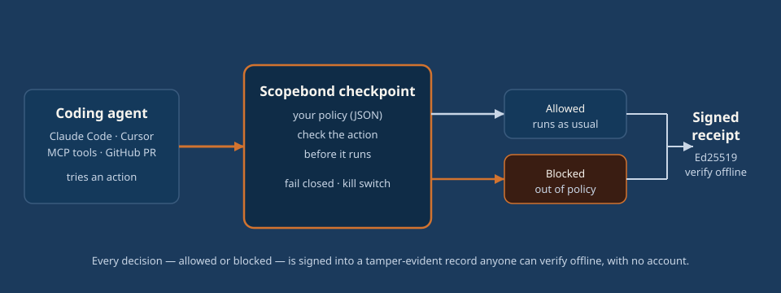

# Scopebond

[](LICENSE)
[](https://github.com/avouro-com/scopebond/actions/workflows/ci.yml)
[](https://www.npmjs.com/package/@scopebond/gateway)
[](https://www.npmjs.com/package/@scopebond/hook)

**Scopebond is an open-source checkpoint for AI coding agents (Claude Code, Cursor,
MCP, GitHub) that blocks out-of-policy actions before they run and signs every
decision into a tamper-evident record anyone can verify offline.** It checks every
action a coding agent takes — a shell command, a file edit, a git push, an MCP tool
call — against rules you write, blocks the ones that break them, and records the rest.

Try it: [scopebond.com](https://scopebond.com) · live policy demo at
[try.scopebond.com](https://try.scopebond.com).

> **Experimental alpha — use controlled test systems only.** The semantics below are
> the target; the alpha is under active hardening. The hosted workspace ("Scopebond
> Cloud") is a separate, proprietary product and is not in this repository.

### Who it's for

- **A developer** running Claude Code or Cursor who wants a guardrail that blocks a
  destructive command before it runs, not a log they read afterward.
- **A team lead** who has to show what the agents did — which actions, decided by which
  rule — to a client, an insurer or an auditor.
- **An auditor or client** who needs to check that record independently, offline, with
  no account and no trust in the vendor.

## 60-second start: govern your coding agent

Put Scopebond in front of Claude Code or Cursor. One command scaffolds a signing
key and a starter policy and wires the hook into your agent:

```bash
npx @scopebond/hook init            # add --cursor for Cursor
```

Then work as usual. A push to `main`, an `rm -rf`, a write to your CI config, a read
of a `*.key` — blocked before it runs. Everything else is recorded. Look at what
happened and check it cryptographically, with no network and no account:

```bash
scopebond-hook log                  # recent decisions
scopebond-hook verify               # every receipt verifies offline
scopebond-hook test "rm -rf /"      # see a decision without running anything
```

The starter policy protects release branches, blocks destructive programs, keeps the
agent out of its own policy and keys, its CI config (`.github/workflows`, and the
other common CI files) and environment secret files (`.env`), and observes network
and MCP calls so you can tighten them when ready. It is a plain JSON file — edit the
limits.

### Maturity

- **The open-source hook, gateway, Action and verifier enforce real rules and sign
  real records today.** They run entirely in your environment; records verify offline
  and nothing phones home. This is an **experimental alpha** — start on test systems
  until the documented safety, integration and operational gates close.
- **Scopebond Cloud** is a separate, proprietary hosted workspace (the shared team
  view, alerts, the monthly report, exports). It is a reviewed beta with billing off,
  not production protection, and is **not** in this repository. Enforcement does not
  depend on it.

## One policy, three uses: prevent · prove · recover

- **Prevent** — the **Scopebond Gateway** sits between an agent and what it can touch
  (MCP tools, HTTP APIs, wallets). You write a machine-readable policy — spend limits,
  allowlists, action bounds, time windows, approvals — and each rule is *enforced*
  (blocked in-flight, **fail closed**) or *monitored* (allowed, but signed and
  flagged). Plus a kill switch.
- **Prove** — every action, allowed or blocked, is countersigned into a tamper-evident
  **`scopebond:receipt`** (Ed25519). Anyone can verify a receipt against the signer's
  published key. A valid signature supports integrity and provenance for what the
  signer asserted; it does not by itself prove an external effect, completeness or
  compliance.
- **Recover** *(roadmap)* — a later, optional layer where an operator backs an agent
  with a refundable deposit against the *same* policy. Non-custodial. Not required to
  use anything above, and not in scope for the alpha.

## How enforcement actually works

The hook maps each native tool call to a normalized action, decomposing a shell
command into every simple command it will run (`a && b`, `$(c)`, `bash -c '…'`), so a
denied program can't ride in behind an allowed one. It records a signed receipt and,
when a call is out of policy, blocks it — otherwise it defers to the agent's own
permission flow (it blocks; it never silently auto-approves). Secrets in commands are
scrubbed before anything is signed or stored. It is cooperative (M0): the agent runs
the allowed action itself. An agent that ignores the hook is not enforced — for
in-path enforcement of money or system actions, put the **gateway** in the path.



## Connectors

| Package | Governs |
|---|---|
| [`@scopebond/hook`](packages/hook) | Claude Code + Cursor tool calls, in-path, before they run. `npx @scopebond/hook init`. |
| [`@scopebond/mcp`](packages/mcp) | Any MCP client, by proxying an upstream MCP server and deciding each `tools/call`. |
| [`@scopebond/framework`](packages/framework) | In-process agents — a Vercel AI SDK / LangGraph tool loop — via a cooperative guard. |
| [`@scopebond/github-action`](packages/github-action) | Pull requests from coding agents, as a required policy check in GitHub Actions. |

Roadmap connectors — **OpenAI Codex**, cloud runtimes and business platforms — are
released one at a time; see the [roadmap](https://scopebond.com/roadmap).

## Core

| Package | What it is |
|---|---|
| [`@scopebond/gateway`](packages/gateway) | The enforcement engine: HTTP + MCP ingress, Ed25519 action evidence, atomic SQLite authority/approval reservations, durable dispatch lifecycle and reconciliation, kill switch, Merkle anchoring. Default execution is a simulation. |
| [`@scopebond/verify`](packages/verify) | `scopebond-verify` — the deterministic `violates(policy, receipts, claimed)` verdict library plus conformance vectors. The portable standard the rest rests on. |
| [`@scopebond/policy-schema`](packages/policy-schema) | The policy vocabulary and the `scopebond:receipt` envelope as JSON Schema, plus the action taxonomy and test vectors. |
| [`@scopebond/sdk`](packages/sdk) | Ed25519 operator signing for agents that emit signed intents. |

The receipt format is documented in **[SPEC.md](SPEC.md)** — the envelope, the action
taxonomy, verification, the conformance vectors, and what a valid signature does and does
not prove.

The on-chain **contracts**, the **registry read API** and the **conformance suite**
are `[PLANNED]`.

## Embed the gateway

```bash
npx @scopebond/gateway init         # writes a key, a key registry and a starter policy
```

```ts
import { createGateway, StaticPrincipalKeyRegistry } from "@scopebond/gateway";
const keys = new StaticPrincipalKeyRegistry(principalKeyRecords);
const { app, handleAction } = createGateway({ policy, authentication: { keys } });
```

Verify a receipt independently, no trust in the server required:

```bash
npx @scopebond/gateway verify ./receipt.json --url http://localhost:8787
```

Runnable end-to-end walkthroughs are in [`examples/`](examples/). Self-host everything
free — no account required.

## What lives here (and what doesn't)

**Here (Apache-2.0):** the connectors, the gateway, the `scopebond-verify` verdict
library and its vectors, the policy schema and the SDK — the open-source product you
self-host and build on.

**Not here:** Avouro's internal docs, marketing site, and the hosted control plane
("Scopebond Cloud"). A commit gate (`scripts/oss-gate.mjs`, enforced on commit, push
and merge) keeps non-public material out of this repository by design.

## Status

Experimental alpha. Published set: `@scopebond/policy-schema@0.3.0`,
`@scopebond/verify@0.2.0`, `@scopebond/gateway@0.6.0`, `@scopebond/sdk@0.1.1`, and the
connectors `@scopebond/hook`, `@scopebond/mcp`, `@scopebond/framework`,
`@scopebond/github-action`. The source tree matches that release set. Use controlled
test systems only until the documented safety, integration and operational gates
close. See [scopebond.com](https://scopebond.com) and the live policy demo at
[try.scopebond.com](https://try.scopebond.com).

## How Scopebond compares

Every cell is what each project's own docs describe; follow the link to check. A dash
means the project does not claim it.

| | Blocks before it runs | Signed record | Verify offline | Claude Code | Cursor | MCP | GitHub PR gate | Open source | Account required |
|---|---|---|---|---|---|---|---|---|---|
| **Scopebond** | Yes (fail-closed) | Yes (Ed25519) | Yes | Yes | Yes | Yes | Yes | Yes (Apache-2.0) | No |
| [Microsoft Agent Governance Toolkit](https://github.com/microsoft/agent-governance-toolkit) | — (governance/policy docs) | Yes | Partial | — | — | Yes | — | Yes (MIT) | No |
| [Agent Receipts](https://agentreceipts.ai/) | — (receipts) | Yes | Yes | — | — | — | — | Partial | Varies |
| [ThumbGate](https://github.com/ThumbLabsAI/thumbgate) | Yes (approval gate) | — | — | Yes | — | Yes | — | Yes | No |
| Hand-written Claude Code hooks | Yes (your script) | — | — | Yes | — | — | — | Your code | No |
| [Endor Labs](https://www.endorlabs.com/) | Partial (CI findings) | — | — | — | — | — | Yes | No | Yes |

Scopebond's distinguishing pair is **blocks before it runs *and* a portable signed
record anyone can verify offline** — enforcement and evidence in one policy.

## FAQ

**How can I see and log everything Claude Code does on my machine?**
Install the hook (`npx @scopebond/hook init`); every tool call is mapped to a
normalized action and written to a signed local receipt. `scopebond-hook log` shows
recent decisions; `scopebond-hook verify` checks them offline.

**How do I block Claude Code from running dangerous commands like `rm -rf` or `git push --force`?**
The starter policy denies destructive programs and force-pushes to protected branches,
and the hook decomposes shell commands so a denied program can't ride in behind an
allowed one. A denied action is blocked before it runs (fail-closed in strict mode).

**What are the best Claude Code hooks for security?**
A security hook should map each tool call to an action, fail closed on anything it
can't parse, protect its own keys and config, and leave a record you can verify.
`@scopebond/hook` does this and signs an offline-verifiable receipt for every decision.

**How do I control what Cursor's agent is allowed to do?**
Run `npx @scopebond/hook init --cursor`; the same policy governs Cursor's tool calls
in-path, blocking out-of-policy actions and signing each decision.

**How do I prove to an auditor or client what an AI coding agent changed and did?**
Every decision is an Ed25519-signed `scopebond:receipt` carrying the action, the rule
that decided and cryptographic fingerprints — never file contents or prompts. Anyone
can verify the record offline against the signer's public key, with no account.

**Is Claude Code safe to use at work?**
Claude Code is as safe as the guardrails around it. Add a fail-closed checkpoint that
blocks destructive actions before they run and records the rest, and start on test
systems. Scopebond is one open-source way to do that; see the [roadmap](https://scopebond.com/roadmap).

**Is there a GitHub Action that fails a pull request when an AI agent breaks policy?**
Yes — `@scopebond/github-action` is a required check that fails an out-of-policy agent
pull request before it can merge and signs a boundary receipt in your own runner.

**How do I put a policy in front of MCP tool calls?**
`@scopebond/mcp` proxies an upstream MCP server and checks every `tools/call` against
your policy in-path, signing a receipt for each decision.

## Using Scopebond? Show it

[](https://scopebond.com)

```md
[](https://scopebond.com)
```

## Contributing

See [CONTRIBUTING.md](CONTRIBUTING.md), [SCOPE.md](SCOPE.md), and
[CODE_OF_CONDUCT.md](CODE_OF_CONDUCT.md); contributions are under a [CLA](CLA.md). To
report a vulnerability, see [SECURITY.md](SECURITY.md).

## License

Apache-2.0 — see [LICENSE](LICENSE) and [NOTICE](NOTICE). © 2026 Avouro LLC.
Scopebond is a trademark of Avouro LLC (https://scopebond.com).

Nothing in this repository is an offer of insurance, securities, or financial
services, or legal or financial advice.
