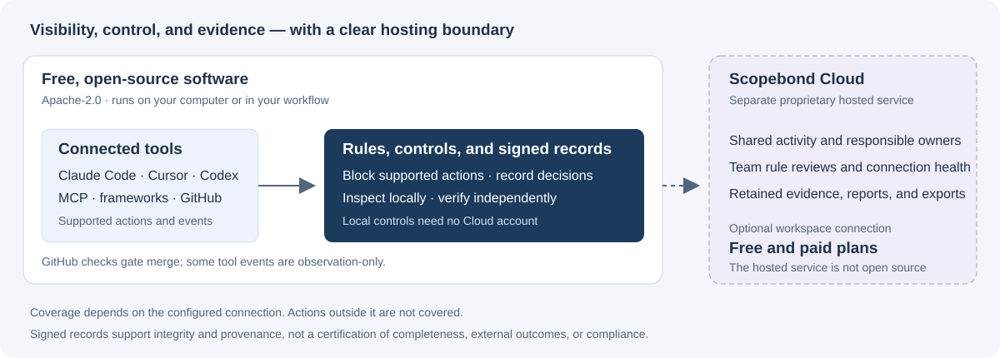

# Scopebond

[](LICENSE)
[](https://github.com/avouro-com/scopebond/actions/workflows/ci.yml)
[](https://www.npmjs.com/package/@scopebond/hook)

**Free, open-source guardrails and verifiable evidence for AI coding agents.**

As organizations adopt more AI, they need clear oversight and accountability:
what did an agent do, how are harmful actions controlled, and what evidence can
they provide? Scopebond's open-source components check supported actions against
your rules and create signed records you can inspect and verify independently.
Connect Claude Code, Cursor, Codex, MCP tools, your agent framework, or GitHub
pull-request checks.

**This repository contains free, Apache-2.0 open-source software. Scopebond Cloud,
the hosted shared workspace, is a separate proprietary service and is not open
source.** Cloud offers Free and paid plans; a Free plan does not make the hosted
service open source. You can use the local controls and verify their records
without a Cloud account.

[Product overview](https://scopebond.com) ·
[Getting started](https://scopebond.com/get-started) ·
[Explore the hosted sample workspace](https://cloud.scopebond.com/app/sample)

## Visibility, control, and evidence

| The question | What the open-source software provides | What the separate hosted workspace adds |
|---|---|---|
| **What did an agent do?** | Local records of supported actions and policy decisions. | Shared activity, responsible owners, computers, connection health, and review queues. |
| **How are we protected against harmful actions?** | Configured rules that block supported actions before execution or merge. | Team rule settings, review workflows, and confirmation of which computers loaded a setting. |
| **Do we have evidence of what an agent did?** | Signed action and decision records with independent verification. | Retained records, team review context, reports, and exports. |

For example, an agent requests a force-push to a protected branch. A configured
hook checks that supported request, denies it under your rule, and signs the
decision. Inspect the record locally or, if connected, review it in Cloud.

Coverage depends on the tool and connection. Some actions can be prevented;
others are observed after they happen. Actions outside the configured connection
are not covered. A signature supports integrity and provenance for what the signer
asserted; it does not by itself prove an external effect, complete coverage, or
regulatory compliance.

## Get started

Use a current Node.js LTS release; the hook and Scopebond Agent require Node
22.13 or later. In Windows PowerShell, use `npx.cmd` or `npm.cmd` if script
execution policy blocks the `.ps1` command; no execution-policy change is needed.

### Shared oversight: the separate hosted service

[Create a free Scopebond Cloud workspace](https://cloud.scopebond.com/app), then
open **Agents → Add an agent** and follow your coding tool's setup. The
[getting-started page](https://scopebond.com/get-started) covers sign-up, device
connection, the optional Scopebond Agent companion, and reviewing first activity.
Cloud's proprietary hosted service has Free and paid plans, separate from the
free open-source packages here.

For Claude Code, run this in your own terminal, outside the coding agent:

```bash
npx -y @scopebond/hook@latest login https://cloud.scopebond.com
```

Add `--cursor` or `--codex` for those tools. The command prints a short code and
an approval link for the workspace owner. For Codex, review Scopebond in `/hooks`,
choose **Trust**, and start a new task. See the [hook README](packages/hook) for
connection details and tool-specific coverage.

### Local controls: free, open source, no account required

Install once for your user account on this computer:

```bash
npm install -g @scopebond/hook@latest
scopebond install
scopebond status
```

`install` configures Claude Code and detects installed Cursor and Codex settings;
you can choose a tool with `--cursor` or `--codex`. For one project's setup:

```bash
npx -y @scopebond/hook@latest init          # Claude Code; add --cursor or --codex
npx -y @scopebond/hook@latest log           # inspect recent decisions
npx -y @scopebond/hook@latest verify        # check stored records offline
```

The starter rules protect release branches, block destructive programs, and
protect configured secret, build, and guardrail settings. Network and MCP calls
are observed by default so you can decide which limits to apply. Edit readable
rules with `scopebond rules`. The [hook README](packages/hook) covers policy trust,
setup scope, diagnostics, and uninstall. In unattended setup, pass `--yes` to
`init` after reviewing the configuration you are authorizing.

## Supported tools and coverage

| Connection | What it checks | Important limit |
|---|---|---|
| [Claude Code, Cursor, and Codex hook](packages/hook) | Supported tool actions delivered through the configured hook. | Cursor file edits are recorded **after** writing, not prevented. Codex file reads are checked when derived from supported shell commands; reads outside that path are not seen. |
| [GitHub Action](packages/github-action) | Policy checks on supported agent pull requests in your own runner. | Make the check required to gate merge. It does not monitor the agent's cloud sandbox; bypass rights remain outside the gate. Signing needs your configured signing key. |
| [MCP proxy](packages/mcp) | Each `tools/call` routed through the proxy before forwarding. | Resource reads and prompt fetches are outside the tool-call policy. |
| [Framework integrations](packages/framework) | Guarded tools in Vercel AI SDK, LangGraph/LangChain, or your own tool loop. | The application must honor the guard; calls outside it are not covered. |

The [hook capability manifest](packages/hook#what-this-hook-can-honestly-claim-capabilities)
separates unsupported, inactive, configured, degraded, and verified-reporting
states. A configured hook or a received signal alone is not verified coverage.

## What is open source, and what is hosted?

All packages here are **free to use and self-host under Apache-2.0**:

| Package | Purpose |
|---|---|
| [`@scopebond/hook`](packages/hook) | Local coding-tool checks, signed records, and optional workspace connection. |
| [`@scopebond/agent`](packages/agent) | Open-source companion for record delivery, connection maintenance, health, and hook repair. Distinct from the AI coding agent doing the work. |
| [`@scopebond/github-action`](packages/github-action) | Required agent pull-request checks in your own runner. |
| [`@scopebond/mcp`](packages/mcp) | A policy-checking proxy for MCP tool calls. |
| [`@scopebond/framework`](packages/framework) | Policy guards for tools inside agent applications. |
| [`@scopebond/gateway`](packages/gateway) | HTTP/MCP policy evaluation, constrained execution, signed evidence, and a kill switch. Default execution is a simulation. |
| [`@scopebond/verify`](packages/verify) | Deterministic policy evaluation, signature verification, and conformance vectors. |
| [`@scopebond/policy-schema`](packages/policy-schema) | Policy, action, receipt, and observation schemas and shared vectors. |
| [`@scopebond/sdk`](packages/sdk) | Signing action intents and approvals and submitting them to a gateway. |

**Scopebond Cloud is not included.** Its hosted portal, tenancy, billing, shared
retention, administration, and review workflows are proprietary. Connecting an
open-source package to Cloud does not change the ownership or license of either.
See [workspace features](https://scopebond.com/hosted) and
[hosted plans](https://scopebond.com/pricing).



The hook evaluates local actions without waiting for Cloud to receive records.
Rules requiring a workspace approval still need that authorization; an unavailable
service does not grant permission. Without a workspace connection, records stay
local. Connected components send configured records and health signals to Cloud.

## Verification and developer examples

[SPEC.md](SPEC.md) describes evidence, action types, verification, and what a
signature does and does not prove. Records omit file contents, prompts, and
secrets; read package-specific data and redaction details before connecting.

Initialize a self-hosted gateway:

```bash
npx -y @scopebond/gateway@latest init
```

```ts
import { createGateway, StaticPrincipalKeyRegistry } from "@scopebond/gateway";
const keys = new StaticPrincipalKeyRegistry(principalKeyRecords);
const { app, handleAction } = createGateway({ policy, authentication: { keys } });
```

See the [gateway README](packages/gateway) for simulation versus execution,
authentication, signing keys, and verification. Runnable examples live in
[`examples/`](examples/); they do not require the proprietary hosted workspace.

## Component maturity and releases

The open-source packages are experimental. Start with controlled test systems and
review each package's coverage and operational limits before important work.
Source availability is not a certification of production protection.

Current release set: `@scopebond/policy-schema@0.6.0`, `@scopebond/verify@0.5.0`,
`@scopebond/gateway@0.16.2`, `@scopebond/sdk@0.1.4`, `@scopebond/hook@0.20.0`,
`@scopebond/agent@0.4.5`, `@scopebond/github-action@0.5.7`, `@scopebond/mcp@2.0.6`,
and `@scopebond/framework@0.3.11`. Release tooling keeps these references in step
with package manifests. Public setup selects npm's latest published release;
generated hook configuration and managed workspace updates can pin versions
separately.

Additional business-platform connections, collateral deposits, and on-chain
registry features are future concepts, not current product capabilities. Existing
policy and verification conformance vectors are available here. See the
[product roadmap](https://scopebond.com/roadmap) for future direction.

## Contributing and support

See [CONTRIBUTING.md](CONTRIBUTING.md), [SCOPE.md](SCOPE.md), and
[CODE_OF_CONDUCT.md](CODE_OF_CONDUCT.md); contributions are under a [CLA](CLA.md).
Report vulnerabilities privately as described in [SECURITY.md](SECURITY.md).
For hosted account or workspace help, use [Scopebond support](mailto:support@scopebond.com).

## License

The software here is Apache-2.0 — see [LICENSE](LICENSE) and [NOTICE](NOTICE).
This license does not cover the proprietary Scopebond Cloud service.
© 2026 Avouro LLC. Scopebond is a trademark of Avouro LLC.

Nothing in this repository is an offer of insurance, securities, or financial
services, or legal or financial advice.
